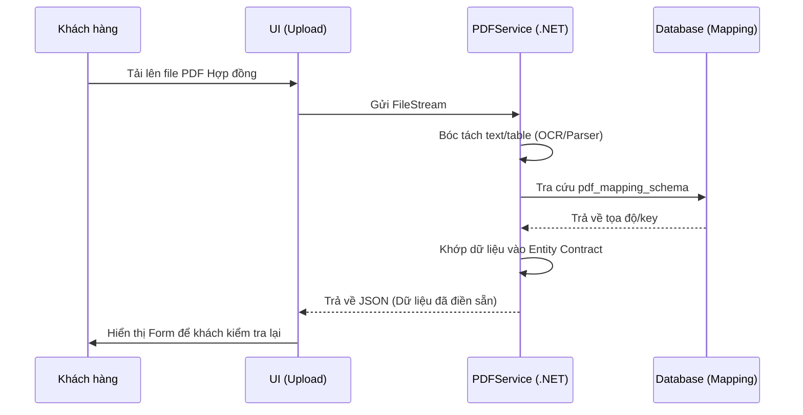
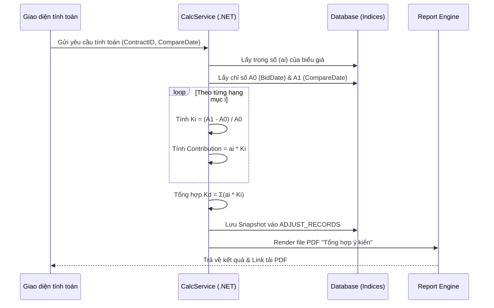
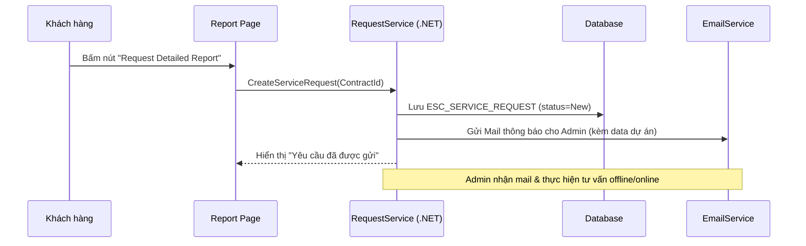

**BÁO CÁO KIẾN TRÚC CƠ SỞ DỮ LIỆU — HỆ THỐNG ESC CON-COST**      Chủ sở hữu: ㈜컨코스트  |  Phiên bản: Rev.15  |  Ngày: 09/05/2026

**BÁO CÁO PHÂN TÍCH & THIẾT KẾ**

**KIẾN TRÚC CƠ SỞ DỮ LIỆU**

**HỆ THỐNG ESC – QUẢN LÝ ĐIỀU CHỈNH GIÁ HỢP ĐỒNG XÂY DỰNG**

ESC Con-Cost v2  |  ㈜컨코스트  |  Rev.15  |  09/05/2026

Tài liệu này trình bày toàn bộ cấu trúc cơ sở dữ liệu, mối quan hệ giữa các bảng, sơ đồ ERD và các đề xuất tối ưu hóa cho Hệ thống Quản lý Điều chỉnh Giá Hợp đồng ESC.


# **1. TÓM TẮT HỆ THỐNG**

## **1.1 Mục tiêu hệ thống**
Hệ thống ESC Con-Cost được xây dựng nhằm tự động hoá quy trình tính toán và quản lý điều chỉnh giá hợp đồng xây dựng theo biến động vật giá (물가변동 조정), căn cứ theo:

- Luật Hợp đồng Địa phương (지방계약법) Điều 22
- Nghị định Thi hành §73 (시행령 §73)
- Quy tắc Thi hành §72 (시행규칙 §72)
- Quy chế Hợp đồng Điều 707 (계약예규 제707조)

## **1.2 Các module chính**

|**Module**|**Chức năng**|**Người dùng**|
| :- | :- | :- |
|⚙️ SetupWizard|Nhập thông tin cơ bản hợp đồng theo từng bước (wizard)|Người dùng|
|📋 Nhập liệu Hợp đồng|Quản lý thông tin hợp đồng, nhà thầu, chủ đầu tư, ngày tháng|Người dùng|
|📊 Nhập liệu Biểu giá (비목군)|Nhập các hạng mục biểu giá và phân bổ theo nhóm chỉ số|Người dùng|
|🗄️ Cơ sở Chỉ số Thời gian (지수 시계열 DB)|Quản lý chuỗi chỉ số theo tháng/năm (YYYYMM) từ 2020 đến nay|Admin/Người dùng|
|🧮 Bộ máy Tính toán|Tính toán tỉ lệ điều chỉnh (Kd) và số tiền điều chỉnh theo §73|Hệ thống|
|🔒 Admin Panel|Ẩn/hiện các vùng thông tin, quản lý mật khẩu, export/import dữ liệu|Admin|
|📄 Báo cáo & In ấn|Xuất báo cáo điều chỉnh giá dạng bảng, tối ưu in PDF|Người dùng|
|📧 Tính năng Email|Gửi yêu cầu điều chỉnh qua email (phase 4.2)|Người dùng|

## **1.3 Stack công nghệ**
- Frontend: React 18 (Single-File Application, không bundler)
- Storage: localStorage / window.storage API (key-value, client-side)
- Ngôn ngữ: JavaScript (ES2020), JSX inline
- Pháp lý tham chiếu: 지방계약법시행령 §73, 계약예규 제707조
- Triển khai: http://con-cost.com/ (Single HTML file)


# **2. XÁC ĐỊNH CẤU TRÚC DỮ LIỆU**

Hệ thống sử dụng localStorage làm tầng lưu trữ. Dưới đây là ánh xạ sang cấu trúc bảng quan hệ (RDBMS equivalent) để chuẩn hóa và dễ bảo trì.

**🔑 = Khóa chính (Primary Key)  |  🔗 = Khóa ngoại (Foreign Key)  |  📌 = Bắt buộc (NOT NULL)**

## **2.1 Bảng CONTRACTS (Hợp đồng)**
Lưu toàn bộ thông tin cơ bản của hợp đồng xây dựng. Tương ứng Storage Key: esc-c-v5.

|**Tên cột**|**Kiểu dữ liệu**|**Mô tả**|**Ràng buộc**|
| :- | :- | :- | :- |
|🔑 contract\_id|VARCHAR(36)|UUID định danh hợp đồng|PK, NOT NULL, DEFAULT uuid()|
|project\_name|NVARCHAR(255)|Tên công trình / dự án|NOT NULL|
|contractor|NVARCHAR(255)|Tên nhà thầu (계약자)|NOT NULL|
|client|NVARCHAR(255)|Tên cơ quan chủ đầu tư (수요기관)|NOT NULL|
|contract\_method|VARCHAR(20)|Phương thức hợp đồng (계속비, 장기계속)|DEFAULT '계속비'|
|bid\_rate|DECIMAL(5,2)|Tỉ lệ trúng thầu %  (낙찰율)|CHECK(0 < bid\_rate <= 100)|
|contract\_date|DATE|Ngày ký hợp đồng (계약체결일)|NOT NULL|
|contract\_amount|BIGINT|Giá trị hợp đồng (원)|NOT NULL, > 0|
|start\_date|DATE|Ngày khởi công (착공일)|NOT NULL|
|completion\_date|DATE|Ngày hoàn công dự kiến (준공예정일)|NOT NULL|
|bid\_date|DATE|Ngày thầu / ngày điều chỉnh trước (기준시점)|NOT NULL|
|compare\_date|DATE|Ngày điều chỉnh hiện tại (비교시점)|NOT NULL|
|adjust\_no|SMALLINT|Lần điều chỉnh (조정 회차)|DEFAULT 1, >= 1|
|advance\_amt|BIGINT|Tiền tạm ứng (선금급)|DEFAULT 0|
|excluded\_amt|BIGINT|Giá trị miễn điều chỉnh (적용제외금액)|DEFAULT 0|
|threshold\_rate|DECIMAL(5,2)|Ngưỡng biến động % (등락율 기준)|DEFAULT 3.0|
|threshold\_days|SMALLINT|Số ngày tối thiểu (경과기간)|DEFAULT 90|
|progress\_plan|VARCHAR(50)|Tiến độ kế hoạch (진도 예정)|NULL|
|progress\_actual|VARCHAR(50)|Tiến độ thực tế (진도 실제)|NULL|
|work\_type|VARCHAR(50)|Loại công trình (전기, 토목, 건축…)|DEFAULT '전기'|
|prepared\_by|NVARCHAR(255)|Đơn vị lập (작성기관)|DEFAULT '㈜컨코스트'|
|prepared\_date|VARCHAR(7)|Năm-tháng lập (YYYY.MM)|NULL|
|admin\_pw\_hash|VARCHAR(64)|Hash mật khẩu Admin|NULL|
|created\_at|TIMESTAMP|Thời điểm tạo|DEFAULT CURRENT\_TIMESTAMP|
|updated\_at|TIMESTAMP|Thời điểm cập nhật cuối|ON UPDATE CURRENT\_TIMESTAMP|

## **2.2 Bảng SA_USER (Tài khoản hội viên & Quản trị)**
Dựa trên IdentityUser hiện có trong source code, bổ sung các trường phục vụ duyệt tài khoản và hội viên.

|**Tên cột**|**Kiểu dữ liệu**|**Mô tả**|**Ràng buộc**|
| :- | :- | :- | :- |
|🔑 id|VARCHAR(36)|UUID định danh người dùng|PK|
|username|NVARCHAR(50)|Tên đăng nhập|NOT NULL, UNIQUE|
|email|NVARCHAR(100)|Email liên lạc/nhận báo cáo|NOT NULL|
|company_name|NVARCHAR(255)|Tên công ty đăng ký|NOT NULL|
|approval_status|INT|0: Chờ duyệt, 1: Đã duyệt, 2: Từ chối|DEFAULT 0|
|request_date|DATETIME|Ngày gửi yêu cầu đăng ký|DEFAULT GETDATE()|
|approved_by|VARCHAR(36)|Admin thực hiện duyệt|FK -> SA_USER(id)|
|approved_date|DATETIME|Ngày thực hiện duyệt|NULL|
|reject_reason|NVARCHAR(MAX)|Lý do từ chối đăng ký|NULL|
|is_paid|BOOLEAN|Trạng thái tài khoản trả phí|DEFAULT FALSE|
|membership_type|VARCHAR(20)|Gói hội viên (Free, Pro...)|DEFAULT 'Free'|


## **2.2 Bảng CONTRACT\_ITEMS (Biểu giá / Hạng mục 비목군)**
Lưu danh sách các hạng mục biểu giá của từng hợp đồng. Tương ứng Storage Key: esc-i-v5.

|**Tên cột**|**Kiểu dữ liệu**|**Mô tả**|**Ràng buộc**|
| :- | :- | :- | :- |
|🔑 item\_id|VARCHAR(36)|UUID định danh hạng mục|PK, NOT NULL|
|🔗 contract\_id|VARCHAR(36)|Liên kết hợp đồng|FK → CONTRACTS(contract\_id), CASCADE DELETE|
|item\_code|VARCHAR(10)|Mã hạng mục (A, A', B, C, D…G5)|NOT NULL|
|group\_name|NVARCHAR(100)|Nhóm biểu giá (노무비, 재료비, 경비…)|NOT NULL|
|item\_name|NVARCHAR(255)|Tên hạng mục chi tiết|NOT NULL|
|index\_key|VARCHAR(50)|Khóa liên kết chỉ số (노임단가, 공산품…)|NOT NULL|
|amount|BIGINT|Giá trị hạng mục (원)|DEFAULT 0|
|sort\_order|SMALLINT|Thứ tự hiển thị|DEFAULT 0|
|is\_active|BOOLEAN|Kích hoạt hạng mục|DEFAULT TRUE|
|created\_at|TIMESTAMP|Thời điểm tạo|DEFAULT CURRENT\_TIMESTAMP|

**Các hạng mục biểu giá được định nghĩa sẵn trong hệ thống:**

|**Mã**|**Nhóm**|**Tên hạng mục**|**Chỉ số liên kết**|
| :- | :- | :- | :- |
|A|노무비|직접노무비 (Nhân công trực tiếp)|노임단가 (Đơn giá nhân công)|
|A'|노무비|간접노무비 (Nhân công gián tiếp)|노임단가|
|B|경비|기계경비 (Chi phí máy thi công)|기계경비 (Chi phí máy)|
|Z|경비|기타비목군 경비 (Chi phí khác)|기타비목군 (CPI tiêu dùng)|
|C|재료비|광산품 (Khoáng sản)|광산품 PPI|
|D|재료비|공산품 (Công nghiệp chế tạo)|공산품 PPI|
|E|재료비|전력·수도·가스 (Điện/Nước/Gas)|전력수도가스 PPI|
|F|재료비|농림수산품 (Nông lâm thủy sản)|농림수산품 PPI|
|G1|표준시장단가|토목 (Công trình dân dụng)|표준\_토목|
|G2|표준시장단가|건축 (Xây dựng kiến trúc)|표준\_건축|
|G3|표준시장단가|기계설비 (Cơ khí)|표준\_기계설비|
|G4|표준시장단가|전기 (Điện)|표준\_전기|
|G5|표준시장단가|통신 (Viễn thông)|표준\_통신|
|I|경비|산업안전보건관리비 (ATSKNN)|안전관리비 (CPI)|
|J|경비|산재보험료 (BH tai nạn LĐ)|산재보험료|
|K|경비|고용보험료 (BH thất nghiệp)|고용보험료|
|L|경비|퇴직공제부금 (Quỹ hưu trí)|퇴직공제부금|
|M|경비|국민건강보험 (BHYT)|국민건강보험|
|N|경비|국민연금 (Hưu bổng)|국민연금|
|O|경비|노인장기요양 (BH dưỡng lão)|노인장기요양|

## **2.3 Bảng INDEX\_TYPES (Loại chỉ số giá)**
Danh mục metadata các loại chỉ số giá sử dụng trong tính toán. Đây là bảng tham chiếu (Reference/Lookup table).

|**Tên cột**|**Kiểu dữ liệu**|**Mô tả**|**Ràng buộc**|
| :- | :- | :- | :- |
|🔑 index\_key|VARCHAR(50)|Mã định danh chỉ số (노임단가, 공산품…)|PK, NOT NULL|
|index\_name|NVARCHAR(255)|Tên đầy đủ của chỉ số|NOT NULL|
|index\_type|VARCHAR(20)|Loại: unit\_price / index (단가형/지수형)|CHECK IN ('unit\_price','index')|
|data\_source|NVARCHAR(255)|Nguồn dữ liệu (한국은행 ECOS, 통계청…)|NOT NULL|
|unit|VARCHAR(50)|Đơn vị (원/인, 상대지수, 원/인-일)|NOT NULL|
|update\_freq|VARCHAR(20)|Tần suất cập nhật (monthly/semi-annual)|NOT NULL|
|hint\_text|NVARCHAR(500)|Ghi chú hướng dẫn nhập liệu|NULL|
|is\_ppi\_type|BOOLEAN|Là chỉ số PPI (quy tắc riêng §73)|DEFAULT FALSE|
|display\_color|VARCHAR(7)|Mã màu hiển thị UI (#RRGGBB)|NULL|

## **2.4 Bảng INDEX\_TIMESERIES (Chuỗi dữ liệu chỉ số theo tháng)**
Lưu toàn bộ giá trị chỉ số theo từng tháng (YYYYMM). Đây là bảng trung tâm của bộ máy tính toán. Tương ứng Storage Key: esc-ts-v5.

|**Tên cột**|**Kiểu dữ liệu**|**Mô tả**|**Ràng buộc**|
| :- | :- | :- | :- |
|🔑 ts\_id|BIGINT AUTO\_INCREMENT|ID bản ghi|PK|
|🔑 period\_key|CHAR(6)|Tháng/năm dạng YYYYMM (202401)|PART OF COMPOSITE PK|
|🔑 index\_key|VARCHAR(50)|Khóa chỉ số|FK → INDEX\_TYPES(index\_key), PART OF COMPOSITE PK|
|index\_value|DECIMAL(18,4)|Giá trị chỉ số tại tháng tương ứng|NOT NULL|
|data\_verified|BOOLEAN|Đã xác minh nguồn dữ liệu|DEFAULT FALSE|
|source\_ref|VARCHAR(255)|Tham chiếu nguồn cụ thể|NULL|
|entered\_by|VARCHAR(100)|Người nhập dữ liệu|NULL|
|entered\_at|TIMESTAMP|Thời điểm nhập|DEFAULT CURRENT\_TIMESTAMP|

**Dữ liệu mẫu trong hệ thống (2020/01 → 2026/12), tổng cộng ~17 chỉ số × 84 tháng ≈ 1,428 bản ghi được nạp sẵn:**

|**Chỉ số (index\_key)**|**Kiểu**|**Giá trị mẫu 2024/01**|**Giá trị mẫu 2026/01**|
| :- | :- | :- | :- |
|노임단가|단가형|258,359 원/인|268,486 원/인|
|기계경비|단가형|60,624 원/인-일|64,601 원/인-일|
|광산품|지수형 (PPI)|135\.42|125\.85|
|공산품|지수형 (PPI)|122\.13|126\.53|
|전력수도가스|지수형 (PPI)|144\.76|148\.95|
|농림수산품|지수형 (PPI)|121\.18|121\.71|
|표준\_전기|단가형|1,779,680 원|1,934,172 원|
|산재보험료|단가형|9,197.58 원/인|9,558.10 원/인|
|기타비목군|지수형 (CPI)|→ CPI준용|→ CPI준용|

## **2.5 Bảng ADJUST\_RECORDS (Lịch sử điều chỉnh)**
Lưu kết quả tính toán mỗi lần điều chỉnh giá. Cho phép lần điều chỉnh 2, 3… kế thừa ngày cơ sở từ lần trước.

|**Tên cột**|**Kiểu dữ liệu**|**Mô tả**|**Ràng buộc**|
| :- | :- | :- | :- |
|🔑 record\_id|VARCHAR(36)|UUID bản ghi|PK, NOT NULL|
|🔗 contract\_id|VARCHAR(36)|Liên kết hợp đồng|FK → CONTRACTS, CASCADE DELETE|
|adjust\_no|SMALLINT|Lần điều chỉnh|NOT NULL, >= 1|
|bid\_date\_used|DATE|Ngày cơ sở sử dụng trong tính toán|NOT NULL|
|compare\_date\_used|DATE|Ngày so sánh sử dụng trong tính toán|NOT NULL|
|elapsed\_days|SMALLINT|Số ngày kinh qua (초일불산입)|NOT NULL|
|kd\_value|DECIMAL(10,6)|Tỉ lệ điều chỉnh tổng hợp (Kd)|NOT NULL|
|kd\_percent|VARCHAR(20)|Tỉ lệ điều chỉnh hiển thị (%)|NOT NULL|
|apply\_amount|BIGINT|Giá trị áp dụng (D = B-C)|NOT NULL|
|gross\_adjust|BIGINT|Số tiền điều chỉnh trước khấu trừ (G)|NOT NULL|
|advance\_deduct|BIGINT|Khấu trừ tiền tạm ứng (F)|DEFAULT 0|
|net\_adjust|BIGINT|Số tiền điều chỉnh ròng (G-F)|NOT NULL|
|threshold\_met|BOOLEAN|Đạt ngưỡng biến động ≥3%|NOT NULL|
|days\_met|BOOLEAN|Đạt điều kiện ≥90 ngày|NOT NULL|
|calc\_snapshot|JSON|Snapshot JSON toàn bộ kết quả tính|NULL|
|created\_at|TIMESTAMP|Thời điểm tạo bản ghi|DEFAULT CURRENT\_TIMESTAMP|

## **2.6 Bảng ADJUST\_ITEM\_DETAILS (Chi tiết điều chỉnh theo hạng mục)**
Lưu kết quả tính toán chi tiết theo từng hạng mục biểu giá trong mỗi lần điều chỉnh.

|**Tên cột**|**Kiểu dữ liệu**|**Mô tả**|**Ràng buộc**|
| :- | :- | :- | :- |
|🔑 detail\_id|VARCHAR(36)|UUID bản ghi chi tiết|PK|
|🔗 record\_id|VARCHAR(36)|Liên kết lần điều chỉnh|FK → ADJUST\_RECORDS|
|🔗 item\_id|VARCHAR(36)|Liên kết hạng mục|FK → CONTRACT\_ITEMS|
|index\_key|VARCHAR(50)|Chỉ số sử dụng|NOT NULL|
|index0|DECIMAL(18,4)|Giá trị chỉ số tại ngày cơ sở (A0)|NOT NULL|
|index1|DECIMAL(18,4)|Giá trị chỉ số tại ngày so sánh (A1)|NOT NULL|
|ki\_value|DECIMAL(10,6)|Chỉ số điều chỉnh hạng mục Ki = (A1-A0)/A0|NOT NULL|
|weight|DECIMAL(10,6)|Trọng số hạng mục ai = amount/total|NOT NULL|
|wi\_ki|DECIMAL(10,6)|Đóng góp vào Kd (ai × Ki)|NOT NULL|
|amount|BIGINT|Giá trị hạng mục (원)|NOT NULL|
|is_manual|BOOLEAN|Đánh dấu người dùng tự nhập tay|DEFAULT FALSE|
|manual_value|DECIMAL(18,4)|Giá trị hệ số do người dùng nhập|NULL|


## **2.7 Bảng ADMIN\_SETTINGS (Cài đặt Admin)**
Lưu cấu hình quản trị: phân quyền ẩn/hiện trường, mật khẩu admin, v.v. Tương ứng Storage Key: esc-setup-v5.

|**Tên cột**|**Kiểu dữ liệu**|**Mô tả**|**Ràng buộc**|
| :- | :- | :- | :- |
|🔑 setting\_key|VARCHAR(100)|Khóa cài đặt|PK|
|setting\_value|TEXT|Giá trị cài đặt (JSON/String)|NULL|
|description|NVARCHAR(255)|Mô tả cài đặt|NULL|
|updated\_at|TIMESTAMP|Thời điểm cập nhật|DEFAULT CURRENT\_TIMESTAMP|

## **2.11 Bảng ESC_SERVICE_REQUEST (Yêu cầu báo cáo chi tiết)**
Lưu vết khi khách hàng nhấn nút "Request" sau khi xem báo cáo sơ bộ.

|**Tên cột**|**Kiểu dữ liệu**|**Mô tả**|**Ràng buộc**|
| :- | :- | :- | :- |
|🔑 request\_id|VARCHAR(36)|UUID định danh yêu cầu|PK|
|🔗 user\_id|VARCHAR(36)|Người yêu cầu|FK -> SA_USER|
|🔗 contract\_id|VARCHAR(36)|Hợp đồng liên quan|FK -> CONTRACTS|
|request\_date|DATETIME|Thời điểm yêu cầu|DEFAULT GETDATE()|
|status|INT|0: Mới, 1: Đang xử lý, 2: Đã gửi báo cáo|DEFAULT 0|
|admin\_note|NVARCHAR(MAX)|Ghi chú của Admin|NULL|
|attachment\_path|NVARCHAR(500)|Đường dẫn file báo cáo chi tiết|NULL|


**Các cài đặt admin tiêu biểu:**

|**setting\_key**|**Mô tả**|
| :- | :- |
|admin\_pw\_hash|Hash mật khẩu admin (mặc định: hash('1234'))|
|hidden\_fields|JSON array các trường bị ẩn khỏi người dùng thường|
|yellow\_zones\_visible|Hiển thị vùng thông tin màu vàng (true/false)|
|auto\_save\_enabled|Bật/tắt tự động lưu localStorage|
|email\_sender|Email gửi yêu cầu điều chỉnh (phase 4.2)|

## **2.8 Bảng INSURANCE\_RATES (Tỉ lệ bảo hiểm theo năm)**
Lưu tỉ lệ các loại bảo hiểm áp dụng theo từng năm, dùng để tính chỉ số đơn giá bảo hiểm. Căn cứ: 계약예규 제707조, 붙임4.

|**Tên cột**|**Kiểu dữ liệu**|**Mô tả**|**Ràng buộc**|
| :- | :- | :- | :- |
|🔑 rate\_id|VARCHAR(20)|Năm áp dụng (YYYY)|PK|
|accident\_rate|DECIMAL(6,4)|Tỉ lệ BH tai nạn lao động 산재보험 (%)|NOT NULL|
|employment\_rate|DECIMAL(6,4)|Tỉ lệ BH thất nghiệp 고용보험 (%)|NOT NULL|
|retirement\_rate|DECIMAL(6,4)|Tỉ lệ quỹ hưu trí 퇴직공제 (%)|NOT NULL|
|health\_rate|DECIMAL(6,4)|Tỉ lệ BHYT 국민건강보험 (%)|NOT NULL|
|pension\_rate|DECIMAL(6,4)|Tỉ lệ hưu bổng 국민연금 (%)|NOT NULL|
|care\_rate|DECIMAL(6,4)|Tỉ lệ BH dưỡng lão 노인장기요양 (%)|NOT NULL|
|base\_wage|BIGINT|Đơn giá nhân công cơ sở (원/인)|NOT NULL|

## **2.9 Bảng AUDIT_LOGS (Nhật ký hệ thống)**
Đã có trong mã nguồn hiện tại, dùng để theo dõi mọi thay đổi dữ liệu.

|**Tên cột**|**Kiểu dữ liệu**|**Mô tả**|**Ràng buộc**|
| :- | :- | :- | :- |
|🔑 id|BIGINT|ID bản ghi nhật ký|PK|
|table_name|VARCHAR(100)|Tên bảng bị tác động|NOT NULL|
|action_type|VARCHAR(20)|Add / Update / Delete|NOT NULL|
|change_values|NVARCHAR(MAX)|Dữ liệu thay đổi dạng JSON|NOT NULL|
|user_name|NVARCHAR(100)|Người thực hiện|NOT NULL|
|timestamp|DATETIME|Thời điểm thực hiện|DEFAULT GETDATE()|

## **2.10 Bảng SETTING_PERMISSION & NOTIFICATION**
Quản lý quyền hạn và thông báo hệ thống.

|**Bảng**|**Chức năng**|**Cột chính**|
| :- | :- | :- |
|SETTING_PERMISSION|Phân quyền chi tiết|Guid, RoleName, PermissionKey, IsAllowed|
|SETTING_NOTIFICATION|Thông báo hệ thống|Guid, Title, Content, TargetUserGuids (JSON)|


# **3. MỐI QUAN HỆ GIỮA CÁC BẢNG**

## **3.1 Quan hệ 1-N (One-to-Many)**

|**Bảng Cha (1)**|**Bảng Con (N)**|**Khóa ngoại**|**Mô tả quan hệ**|
| :- | :- | :- | :- |
|CONTRACTS|CONTRACT\_ITEMS|contract\_id|1 hợp đồng có nhiều hạng mục biểu giá (10-20 hạng mục)|
|CONTRACTS|ADJUST\_RECORDS|contract\_id|1 hợp đồng có thể có nhiều lần điều chỉnh giá (1, 2, 3…)|
|ADJUST\_RECORDS|ADJUST\_ITEM\_DETAILS|record\_id|1 lần điều chỉnh chứa chi tiết tính toán từng hạng mục|
|INDEX\_TYPES|INDEX\_TIMESERIES|index\_key|1 loại chỉ số có nhiều giá trị theo tháng (chuỗi thời gian)|
|CONTRACT\_ITEMS|ADJUST\_ITEM\_DETAILS|item\_id|1 hạng mục xuất hiện trong nhiều lần điều chỉnh|

## **3.2 Quan hệ 1-1 (One-to-One)**

|**Bảng A**|**Bảng B**|**Khóa liên kết**|**Mô tả**|
| :- | :- | :- | :- |
|CONTRACTS|ADMIN\_SETTINGS|— (global)|Hiện tại cài đặt admin là toàn cục (1 tenant). Khi mở rộng đa tenant cần thêm FK contract\_id|
|INSURANCE\_RATES|INDEX\_TIMESERIES|year(period\_key)|Tỉ lệ bảo hiểm năm Y sinh ra đơn giá bảo hiểm trong chuỗi thời gian (tương quan logic, không FK cứng)|

## **3.3 Quan hệ N-N (Many-to-Many) — Thông qua bảng trung gian**

|**Bảng A**|**Bảng Trung gian**|**Bảng B**|**Mô tả**|
| :- | :- | :- | :- |
|CONTRACT\_ITEMS|ADJUST\_ITEM\_DETAILS|ADJUST\_RECORDS|Mỗi hạng mục (N) tham gia vào nhiều lần điều chỉnh (M). Bảng ADJUST\_ITEM\_DETAILS là bảng junction lưu kết quả tính toán tại giao điểm.|

## **3.4 Quan hệ Tham chiếu Logic (Index Mapping)**
**CONTRACT\_ITEMS.index\_key → INDEX\_TYPES.index\_key → INDEX\_TIMESERIES.index\_key**

Đây là chuỗi tra cứu chỉ số: hạng mục biểu giá được ánh xạ tới loại chỉ số, loại chỉ số tra giá trị từ chuỗi thời gian theo ngày cơ sở và ngày so sánh.

# **4. MÔ HÌNH HÓA NGHIỆP VỤ (DIAGRAMS)**

## **4.1 Module 1: Quản lý Hội viên & Duyệt tài khoản**

### **A. Sơ đồ Usecase Chi tiết - Quản lý Hội viên**
```mermaid
usecaseDiagram
    actor "Khách hàng" as User
    actor "Quản trị viên" as Admin
    
    package "Module Hội viên" {
        User --> (UC01: Đăng ký tài khoản)
        User --> (UC02: Cập nhật hồ sơ công ty)
        (UC01) ..> (UC03: Chờ phê duyệt) : include
        
        Admin --> (UC04: Danh sách chờ duyệt)
        Admin --> (UC05: Phê duyệt/Từ chối)
        Admin --> (UC06: Khóa/Mở khóa hội viên)
        
        (UC05) ..> (UC07: Gửi Email thông báo) : include
    }
```

### **B. Sơ đồ Usecase Chi tiết - Nghiệp vụ Hợp đồng**
```mermaid
usecaseDiagram
    actor "Khách hàng" as User
    
    package "Module Quản lý Hợp đồng" {
        User --> (UC08: Tạo mới dự án)
        User --> (UC09: Nhập thông tin Hợp đồng)
        User --> (UC10: Thiết lập biểu giá Weightage)
        User --> (UC11: Tải lên PDF Auto-fill)
        User --> (UC12: Import/Export JSON)
        
        (UC11) ..> (UC09) : extend
    }
```

### **C. Sơ đồ Usecase Chi tiết - Tính toán & Báo cáo**
```mermaid
usecaseDiagram
    actor "Khách hàng" as User
    actor "Hệ thống" as System
    
    package "Module Tính toán & Báo cáo" {
        User --> (UC13: Chọn ngày so sánh)
        User --> (UC14: Thực hiện tính Kd)
        User --> (UC15: Xem báo cáo sơ bộ)
        User --> (UC16: Request Báo cáo chuyên sâu)
        
        (UC14) --> System : "Xử lý công thức"
        (UC16) ..> (UC17: Gửi Email cho Admin) : include
    }
```

### **D. Sơ đồ Usecase Chi tiết - Quản trị Admin**
```mermaid
usecaseDiagram
    actor "Quản trị viên" as Admin
    
    package "Module Quản trị hệ thống" {
        Admin --> (UC18: Cập nhật chỉ số giá PPI/CPI)
        Admin --> (UC19: Cấu hình ẩn dữ liệu - Blind)
        Admin --> (UC20: Xử lý Service Request)
        Admin --> (UC21: Xem Audit Logs)
        Admin --> (UC22: Cập nhật tỉ lệ Bảo hiểm năm)
    }
```


### **B. Sơ đồ Hoạt động (Activity Diagram) - Quy trình Duyệt**
```mermaid
activityDiagram
    start
    :Khách hàng điền Form đăng ký;
    :Hệ thống lưu tài khoản (Trạng thái: Chờ duyệt);
    :Gửi thông báo cho Admin;
    if (Admin thẩm định hồ sơ?) then (Đồng ý)
        :Chuyển trạng thái: Đã duyệt;
        :Gửi Email chúc mừng & Kích hoạt login;
    else (Từ chối)
        :Yêu cầu nhập lý do từ chối;
        :Gửi Email thông báo lý do;
        :Xóa hoặc Khóa tài khoản;
    end
    stop
```

### **C. Sơ đồ Tuần tự (Sequence Diagram) - Đăng ký**
```mermaid
sequenceDiagram
    participant U as Khách hàng
    participant F as Register Form
    participant S as AuthService (C#)
    participant D as Database
    participant E as EmailService

    U->>F: Nhập thông tin & Submit
    F->>S: Gửi yêu cầu đăng ký
    S->>D: Kiểm tra trùng lặp (Email/User)
    D-->>S: OK
    S->>D: Lưu SA_USER (status=Pending)
    S->>E: Gửi email xác nhận cho khách
    S->>E: Gửi email thông báo cho Admin
    S-->>F: Hiển thị "Vui lòng chờ duyệt"

### **D. Sơ đồ Tuần tự - Phê duyệt hội viên (Admin)**
```mermaid
sequenceDiagram
    participant A as Admin
    participant P as Admin Panel (Blazor)
    participant S as UserService (.NET)
    participant D as Database
    participant E as EmailService

    A->>P: Xem danh sách Pending
    P->>S: GetPendingUsers()
    S->>D: Query SA_USER where status=0
    D-->>P: List Users
    A->>P: Bấm Phê duyệt (Approve)
    P->>S: ApproveUser(UserId)
    S->>D: Update status=1, ApprovedDate
    S->>E: SendEmail(Approved_Welcome)
    S-->>P: Thành công
```

---

## **4.2 Module 2: Thiết lập Hợp đồng (Setup Wizard)**

### **A. Sơ đồ Hoạt động (Activity Diagram)**
```mermaid
activityDiagram
    start
    :Bắt đầu Wizard;
    :Bước 1: Nhập thông tin chung hợp đồng;
    :Bước 2: Thiết lập Biểu giá (A, B, C...);
    :Bước 3: Gán chỉ số giá cho từng hạng mục;
    :Bước 4: Kiểm tra điều kiện (90 ngày/3%);
    if (Dữ liệu hợp lệ?) then (Có)
        :Lưu Hợp đồng & Biểu giá;
    else (Không)
        :Hiển thị lỗi validation;
        backward:Quay lại chỉnh sửa;
    end
    stop
```

### **B. Sơ đồ Tuần tự - PDF Auto-fill (Bóc tách dữ liệu)**


---

## **4.3 Module 3: Bộ máy tính toán ESC (Calculation Engine)**

### **A. Sơ đồ Tuần tự (Sequence Diagram) - Tính toán Kd**


### **B. Sơ đồ Hoạt động - Logic Engine tính Kd**
```mermaid
activityDiagram
    start
    :Nhận ContractID & CompareDate;
    :Tải trọng số biểu giá {ai};
    :Tải chỉ số giá gốc A0 (từ bid_date);
    :Tải chỉ số giá so sánh A1 (từ compare_date);
    if (Thiếu chỉ số A0 hoặc A1?) then (Có)
        :Yêu cầu người dùng nhập bổ sung;
    else (Đủ)
        partition "Tính toán Kd" {
            :Tính Ki = (A1 - A0) / A0 cho từng hạng mục;
            :Tính ai * Ki;
            :Tính Kd = Tổng(ai * Ki);
        }
        :Kiểm tra điều kiện bù giá (Kd >= 3%?);
        :Lưu Snapshot vào Database;
        :Render báo cáo Web;
    end
    stop
```

---

## **4.4 Module 4: Quản trị Chỉ số & Cấu hình Hệ thống**

### **A. Sơ đồ Hoạt động - Cập nhật chỉ số tháng**
```mermaid
activityDiagram
    start
    :Admin chọn Tháng/Năm;
    :Chọn Loại chỉ số (PPI/CPI/Unit Price);
    :Nhập giá trị thực tế;
    :Hệ thống kiểm tra dữ liệu trùng lặp;
    if (Hợp lệ?) then (Có)
        :Lưu vào INDEX_TIMESERIES;
        :Ghi log vào AuditLogs;
        :Thông báo cho các Hội viên liên quan;
    else (Lỗi)
        :Báo lỗi (Dữ liệu đã tồn tại);
    end
    stop
```

---

## **4.5 Module 5: Xử lý Yêu cầu dịch vụ (Request flow)**

### **A. Sơ đồ Tuần tự - Quy trình nhấn nút "Request"**


# **5. SƠ ĐỒ ERD (Mermaid)**

Sơ đồ dưới đây thể hiện toàn bộ các bảng và mối quan hệ. Copy đoạn code vào https://mermaid.live để render.


erDiagram


`  `CONTRACTS {

`    `string  contract\_id PK

`    `string  project\_name

`    `string  contractor

`    `string  client

`    `string  contract\_method

`    `decimal bid\_rate

`    `date    contract\_date

`    `bigint  contract\_amount

`    `date    start\_date

`    `date    completion\_date

`    `date    bid\_date

`    `date    compare\_date

`    `int     adjust\_no

`    `bigint  advance\_amt

`    `bigint  excluded\_amt

`    `decimal threshold\_rate

`    `int     threshold\_days

`    `string  work\_type

`    `string  prepared\_by

`    `string  admin\_pw\_hash

`  `}


`  `CONTRACT\_ITEMS {

`    `string  item\_id PK

`    `string  contract\_id FK

`    `string  item\_code

`    `string  group\_name

`    `string  item\_name

`    `string  index\_key FK

`    `bigint  amount

`    `int     sort\_order

`    `boolean is\_active

`  `}


`  `INDEX\_TYPES {

`    `string  index\_key PK

`    `string  index\_name

`    `string  index\_type

`    `string  data\_source

`    `string  unit

`    `string  update\_freq

`    `boolean is\_ppi\_type

`  `}


`  `INDEX\_TIMESERIES {

`    `bigint  ts\_id PK

`    `string  period\_key "YYYYMM"

`    `string  index\_key FK

`    `decimal index\_value

`    `boolean data\_verified

`    `string  entered\_by

`  `}


`  `ADJUST\_RECORDS {

`    `string  record\_id PK

`    `string  contract\_id FK

`    `int     adjust\_no

`    `date    bid\_date\_used

`    `date    compare\_date\_used

`    `int     elapsed\_days

`    `decimal kd\_value

`    `bigint  apply\_amount

`    `bigint  gross\_adjust

`    `bigint  advance\_deduct

`    `bigint  net\_adjust

`    `boolean threshold\_met

`    `boolean days\_met

`  `}


`  `ADJUST\_ITEM\_DETAILS {

`    `string  detail\_id PK

`    `string  record\_id FK

`    `string  item\_id FK

`    `string  index\_key

`    `decimal index0

`    `decimal index1

`    `decimal ki\_value

`    `decimal weight

`    `decimal wi\_ki

`  `}


`  `ADMIN\_SETTINGS {

`    `string  setting\_key PK

`    `text    setting\_value

`    `string  description

`  `}


`  `INSURANCE\_RATES {

`    `string  rate\_id PK "YYYY"

`    `decimal accident\_rate

`    `decimal employment\_rate

`    `decimal retirement\_rate

`    `decimal health\_rate

`    `decimal pension\_rate

`    `decimal care\_rate

`    `bigint  base\_wage

`  `}


`  `CONTRACTS ||--o{ CONTRACT\_ITEMS : "has"

`  `CONTRACTS ||--o{ ADJUST\_RECORDS : "generates"

`  `CONTRACT\_ITEMS ||--o{ ADJUST\_ITEM\_DETAILS : "included\_in"

`  `ADJUST\_RECORDS ||--o{ ADJUST\_ITEM\_DETAILS : "contains"

`  `INDEX\_TYPES   ||--o{ INDEX\_TIMESERIES : "has\_values"

`  `INDEX\_TYPES   ||--o{ CONTRACT\_ITEMS : "mapped\_to"


# **5. CHUẨN HÓA DỮ LIỆU**

## **5.1 Kiểm tra chuẩn 1NF (First Normal Form)**

|**Bảng**|**Đánh giá**|**Ghi chú**|
| :- | :- | :- |
|CONTRACTS|✅ Đạt 1NF|Mỗi ô chứa giá trị nguyên tử. Không có cột lặp.|
|CONTRACT\_ITEMS|✅ Đạt 1NF|Mỗi hạng mục là 1 dòng riêng biệt.|
|INDEX\_TIMESERIES|✅ Đạt 1NF|Mỗi (period\_key, index\_key) là 1 dòng.|
|ADJUST\_ITEM\_DETAILS|✅ Đạt 1NF|Mỗi hạng mục trong 1 lần điều chỉnh là 1 dòng.|
|ADMIN\_SETTINGS|✅ Đạt 1NF|Key-value store, mỗi cài đặt 1 dòng.|

## **5.2 Kiểm tra chuẩn 2NF (Second Normal Form)**

|**Bảng**|**Đánh giá**|**Ghi chú**|
| :- | :- | :- |
|CONTRACTS|✅ Đạt 2NF|PK đơn (contract\_id), không có phụ thuộc cục bộ.|
|CONTRACT\_ITEMS|✅ Đạt 2NF|PK đơn (item\_id). Mọi cột phụ thuộc đầy đủ vào item\_id.|
|INDEX\_TIMESERIES|✅ Đạt 2NF|PK tổ hợp (period\_key, index\_key). index\_value phụ thuộc vào cả hai.|
|ADJUST\_ITEM\_DETAILS|✅ Đạt 2NF|PK đơn (detail\_id). Mọi cột phụ thuộc đầy đủ.|

## **5.3 Kiểm tra chuẩn 3NF (Third Normal Form)**

|**Bảng**|**Đánh giá**|**Ghi chú**|
| :- | :- | :- |
|CONTRACTS|✅ Đạt 3NF|Không có phụ thuộc bắc cầu.|
|CONTRACT\_ITEMS|⚠️ Cần xem xét|item\_name phụ thuộc vào item\_code (mã cố định). Nên tách bảng ITEM\_MASTER nếu mã cố định.|
|INDEX\_TIMESERIES|✅ Đạt 3NF|Không có phụ thuộc bắc cầu.|
|ADJUST\_RECORDS|⚠️ Cần xem xét|elapsed\_days có thể tính từ bid\_date\_used + compare\_date\_used → Cân nhắc computed column.|

## **5.4 Các điểm tối ưu đề xuất**
- Tách bảng ITEM\_MASTER: Tạo bảng riêng cho danh mục hạng mục (item\_code, group\_name, item\_name, index\_key) để tránh lặp dữ liệu khi cùng loại hợp đồng.
- Tách bảng WORK\_TYPE\_CONFIG: Cấu hình loại công trình và các hạng mục mặc định theo loại (전기, 토목, 건축…).
- Thêm bảng USER\_SESSIONS: Khi mở rộng sang multi-user, cần quản lý phiên đăng nhập admin.
- INDEX trên INDEX\_TIMESERIES: Tạo composite index (period\_key, index\_key) để tăng tốc tra cứu trong bộ máy tính.
- Lưu trữ kết quả tính toán (ADJUST\_RECORDS): Hiện tại chỉ lưu trên localStorage. Cần backend DB khi scale ra nhiều người dùng.


# **6. BÁO CÁO TỔNG HỢP**

## **6.1 Tổng kết cấu trúc Database**

|**Bảng**|**Mục đích**|**Số cột ước tính**|**Ưu tiên**|
| :- | :- | :- | :- |
|CONTRACTS|Thông tin hợp đồng chính|24|🔴 Core|
|CONTRACT\_ITEMS|Biểu giá hạng mục|10|🔴 Core|
|INDEX\_TYPES|Danh mục chỉ số (Reference)|9|🔴 Core|
|INDEX\_TIMESERIES|Chuỗi chỉ số theo tháng|8|🔴 Core|
|ADJUST\_RECORDS|Lịch sử điều chỉnh giá|16|🟡 Business|
|ADJUST\_ITEM\_DETAILS|Chi tiết điều chỉnh hạng mục|10|🟡 Business|
|ADMIN\_SETTINGS|Cài đặt Admin|4|🟢 Admin|
|SA\_USER|Tài khoản & Duyệt hội viên|11|🔴 Core|
|ESC\_SERVICE\_REQUEST|Yêu cầu dịch vụ (Lead)|7|🟡 Business|
|AUDIT\_LOGS|Nhật ký thay đổi|6|🟡 System|

|AUDIT\_LOGS|Nhật ký thay đổi|6|🟡 System|
|INSURANCE\_RATES|Tỉ lệ bảo hiểm theo năm|8|🟢 Reference|

|INSURANCE\_RATES|Tỉ lệ bảo hiểm theo năm|8|🟢 Reference|

## **6.2 Điểm chưa rõ – Cần xác nhận**
**⚠️  Các mục dưới đây cần được xác nhận với team phát triển và chủ đầu tư**

- Multi-tenant: Hệ thống hiện tại là single-user (1 file HTML, 1 localStorage). Khi triển khai lên con-cost.com, cần xác nhận: 1 người dùng duy nhất hay nhiều tài khoản?
- Backup & Restore: Cơ chế export/import JSON đã có trong GĐ 2.2. Cần xác nhận định dạng file export (JSON, Excel?) và cấu trúc schema.
- Email (GĐ 4.2): Cần xác nhận địa chỉ email sử dụng và provider (SMTP, SendGrid?) để thiết kế bảng EMAIL\_LOGS.
- PDF Auto-read (GĐ 4.2): Cần xác nhận cấu trúc file PDF hợp đồng để thiết kế parser. Có template chuẩn không?
- Versioning dữ liệu chỉ số: Khi chỉ số được cập nhật hàng tháng, có cần lưu lịch sử chỉnh sửa (audit trail) không?
- Đa hợp đồng: Hiện tại 1 tab = 1 hợp đồng. Kế hoạch quản lý danh sách nhiều hợp đồng cùng lúc?
- Role phân quyền: Admin PW hiện là 1234 cố định. Cần bảng USERS nếu có nhiều admin?

## **6.3 Đề xuất cải tiến**
**✅  Đề xuất ưu tiên cao (short-term)**

- GĐ 1 (Kiến trúc): Thêm bảng ITEM\_MASTER để tránh duplicate dữ liệu tên hạng mục giữa các hợp đồng cùng loại công trình.
- GĐ 2 (Lưu trữ): Chuẩn hoá cấu trúc JSON trong localStorage theo schema đã thiết kế, thêm version field (schema\_version) để dễ migrate sau này.
- GĐ 3 (Tính toán): Lưu snapshot JSON đầy đủ của từng lần tính (calc\_snapshot) trong ADJUST\_RECORDS để audit và tái hiện kết quả.
- GĐ 3 (Validation): Bổ sung kiểm tra: elapsed\_days ≥ threshold\_days VÀ |kd\_value| ≥ threshold\_rate trước khi cho phép lưu điều chỉnh.

**🔵  Đề xuất trung hạn (medium-term)**

- Backend API: Khi deploy lên con-cost.com cho nhiều người dùng, cần migrate từ localStorage sang REST API + MySQL/PostgreSQL với schema đã thiết kế.
- Bảng AUDIT\_LOG: Ghi nhật ký mọi thao tác (tạo/sửa/xóa) hợp đồng và điều chỉnh, kèm user\_id và timestamp.
- Bảng EMAIL\_LOGS: Lưu lịch sử gửi email yêu cầu điều chỉnh (phase 4.2).
- Bảng INDEX\_UPDATES: Ghi nhật ký cập nhật chỉ số theo tháng, ai cập nhật, khi nào, thay thế giá trị nào.

## **6.4 Luồng tính toán điều chỉnh giá (Tóm tắt)**
**Công thức điều chỉnh giá theo 지방계약법시행령 §73:**

**Kd = Σ(ai × Ki)    trong đó:**

ai  = amount\_i / total\_contract\_amount   (trọng số hạng mục)

Ki  = (index1\_i - index0\_i) / index0\_i    (tỉ lệ biến động chỉ số)

→ Số tiền điều chỉnh = Kd × (B - C) - F

|**Biến**|**Tên**|**Nguồn dữ liệu**|
| :- | :- | :- |
|B|Giá trị hợp đồng|CONTRACTS.contract\_amount|
|C|Giá trị miễn điều chỉnh|CONTRACTS.excluded\_amt|
|F|Tiền tạm ứng phải khấu trừ|CONTRACTS.advance\_amt × Kd (theo quy định)|
|ai|Trọng số hạng mục i|CONTRACT\_ITEMS.amount / Σ amount|
|A0 (index0)|Chỉ số tại ngày cơ sở|INDEX\_TIMESERIES WHERE period\_key = toKey(bid\_date)|
|A1 (index1)|Chỉ số tại ngày so sánh|INDEX\_TIMESERIES WHERE period\_key = toKey(compare\_date)|
|Kd|Tỉ lệ điều chỉnh tổng hợp|Tính toán → lưu ADJUST\_RECORDS.kd\_value|

# **8. QUY ĐỊNH NGHIỆP VỤ ĐẶC THÙ (BOSS REQUIREMENTS)**

## **8.1 Logic điều kiện "Request"**
- Hệ thống chỉ hiển thị nút **"Request" (Yêu cầu báo cáo chi tiết)** khi kết quả tính toán sơ bộ thỏa mãn:
  - `elapsed_days` (tính từ `bid_date`) $\ge$ 90 ngày.
  - `kd_value` (tỉ lệ biến động) $\ge$ 3% (0.03).
- Khi nhấn Request: Hệ thống tự động gửi Email thông báo tới Admin qua Server .NET 8.

## **8.2 Bảo mật công thức (Blind Data)**
- Toàn bộ công thức tính toán Kd nằm tại **Server-side (.NET 8)**.
- Dữ liệu thô (Raw data) được trả về Client. Admin có quyền cấu hình ẩn các trường nhạy cảm qua bảng `ADMIN_SETTINGS`.
- Tính năng **Export/Import**: Định dạng file trao đổi là JSON/Excel nhưng chỉ chứa các giá trị số (Values), không chứa công thức Excel hay Logic tính toán.

## **8.3 Tự động hóa nhập liệu (PDF Auto-fill)**
- Sử dụng thư viện phía Server để xử lý File PDF khách hàng tải lên.
- Trích xuất thông tin dựa trên `pdf_mapping_schema` và điền tự động vào bảng `CONTRACTS` và `CONTRACT_ITEMS`.


# **9. GIAO DIỆN HỆ THỐNG (UI PROTOTYPE)**

Dưới đây là các màn hình chức năng chính được trích xuất từ bản mẫu (Prototype), làm căn cứ để thiết kế các Razor Component trên .NET 8.

### **9.1 Màn hình Wizard - Bước 1 (Entry Point)**
Đây là giao diện đầu tiên khi người dùng tạo hồ sơ mới. Tính năng **PDF/Image Auto-fill** nằm ở vùng khung xanh đứt đoạn, cho phép bóc tách dữ liệu tự động để điền vào form bên dưới.


### **9.2 Màn hình Thiết lập Hợp đồng & Mốc thời gian (Sau Wizard)**
Màn hình này tương ứng với bảng **CONTRACTS**, nơi quản lý thông tin chi tiết sau khi đã qua bước thiết lập ban đầu.


### **9.3 Màn hình Cấu hình Biểu giá (Weightage)**
Giao diện để thiết lập tỷ trọng (ai) cho từng nhóm chi phí, tương ứng với bảng **CONTRACT_ITEMS**.


### **9.4 Màn hình Bảng tính toán chi tiết Kd**
Hiển thị logic so sánh chỉ số giá A0 và A1, tính toán hệ số biến động Ki cho từng hạng mục.


### **9.5 Báo cáo Tổng hợp (종합의견서)**
Sản phẩm cuối cùng để xuất PDF gửi khách hàng. Các vùng màu vàng có thể bị ẩn nếu Admin cấu hình "Blind".


### **9.6 Giao diện Quản trị (Admin Panel)**
Nơi Admin cập nhật cơ sở dữ liệu chỉ số giá hàng tháng (Time Series DB), tương ứng với bảng **INDEX_TIMESERIES**.


### **9.6 Giao diện Đăng ký & Đăng nhập (Đề xuất đồng bộ)**
Màn hình truy cập hệ thống dành cho khách hàng, tuân thủ bảng màu Xanh Navy (#1e3a5f) và phong cách thiết kế phẳng (Flat Design) của bản mẫu.


### **9.7 Giao diện Dashboard Khách hàng (Đề xuất đồng bộ)**
Màn hình quản lý danh sách dự án, sử dụng cấu trúc bảng và thẻ (Card) đồng nhất với các màn hình nghiệp vụ khác.


---

---

# **10. KẾT LUẬN**
Tài liệu này đã bao quát toàn bộ khía cạnh từ Kiến trúc dữ liệu, Mô hình hóa nghiệp vụ đến Giao diện thực tế. Đây là nền tảng vững chắc để triển khai hệ thống ESC Con-Cost trên .NET 8.

**Tài liệu được lập bởi:** Database Architect / Business Analyst  
**Ngày:** 09/05/2026 | **Phiên bản:** 1.1 | **Hệ thống:** ESC Con-Cost Rev.15
