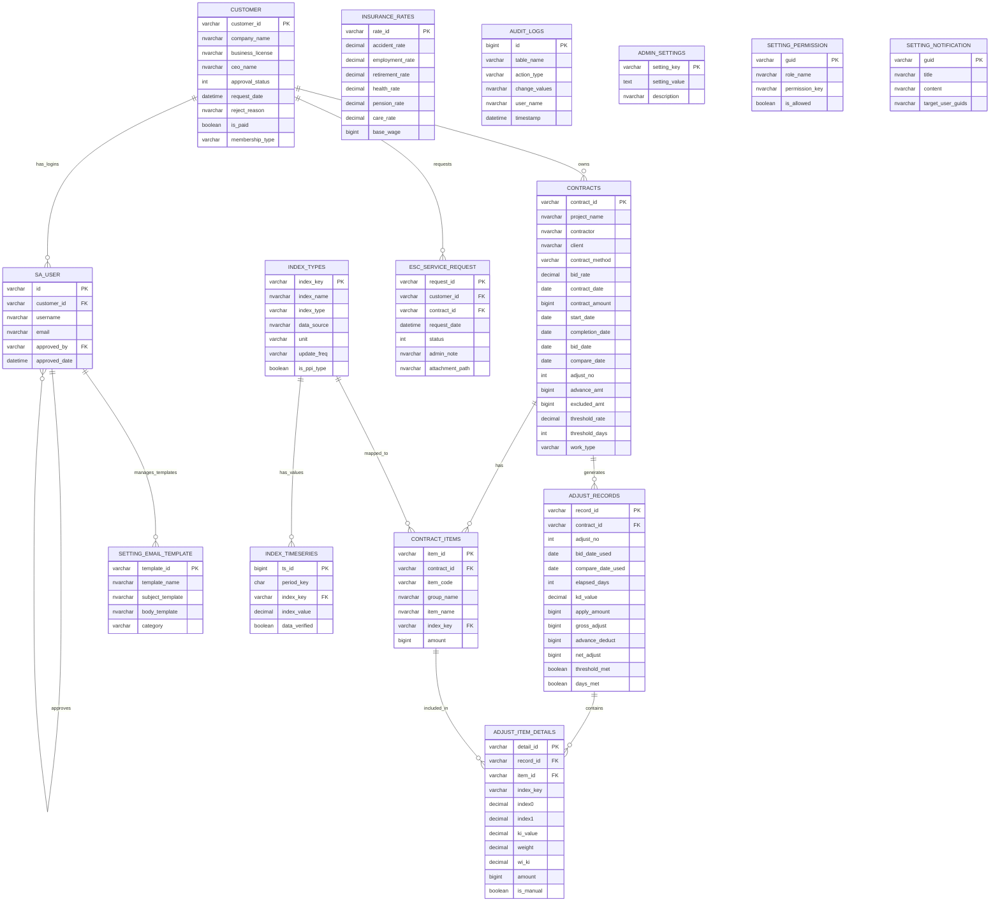

# SƠ ĐỒ ERD & ĐỊNH NGHĨA DATABASE CHUẨN - ESC CON-COST

Tài liệu này lưu trữ sơ đồ quan hệ thực thể (ERD) và chi tiết cấu trúc các bảng của hệ thống ESC.

---

## **1. SƠ ĐỒ ERD (MERMAID)**

```mermaid
erDiagram
    CONTRACTS ||--o{ CONTRACT_ITEMS : has
    CONTRACTS ||--o{ ADJUST_RECORDS : generates
    CUSTOMER ||--o{ SA_USER : has_logins
    SA_USER ||--o{ SA_USER : approves
    CUSTOMER ||--o{ CONTRACTS : owns
    CUSTOMER ||--o{ ESC_SERVICE_REQUEST : requests
    SA_USER ||--o{ SETTING_EMAIL_TEMPLATE : manages_templates

    INDEX_TYPES ||--o{ INDEX_TIMESERIES : has_values
    INDEX_TYPES ||--o{ CONTRACT_ITEMS : mapped_to

    ADJUST_RECORDS ||--o{ ADJUST_ITEM_DETAILS : contains
    CONTRACT_ITEMS ||--o{ ADJUST_ITEM_DETAILS : included_in

    INSURANCE_RATES {
        varchar rate_id PK
        decimal accident_rate
        decimal employment_rate
        decimal retirement_rate
        decimal health_rate
        decimal pension_rate
        decimal care_rate
        bigint base_wage
    }

    AUDIT_LOGS {
        bigint id PK
        varchar table_name
        varchar action_type
        nvarchar change_values
        nvarchar user_name
        datetime timestamp
    }

    CONTRACTS {
        varchar contract_id PK
        nvarchar project_name
        nvarchar contractor
        nvarchar client
        varchar contract_method
        decimal bid_rate
        date contract_date
        bigint contract_amount
        date start_date
        date completion_date
        date bid_date
        date compare_date
        int adjust_no
        bigint advance_amt
        bigint excluded_amt
        decimal threshold_rate
        int threshold_days
        varchar work_type
    }

    CONTRACT_ITEMS {
        varchar item_id PK
        varchar contract_id FK
        varchar item_code
        nvarchar group_name
        nvarchar item_name
        varchar index_key FK
        bigint amount
    }

    INDEX_TYPES {
        varchar index_key PK
        nvarchar index_name
        varchar index_type
        nvarchar data_source
        varchar unit
        varchar update_freq
        boolean is_ppi_type
    }

    INDEX_TIMESERIES {
        bigint ts_id PK
        char period_key
        varchar index_key FK
        decimal index_value
        boolean data_verified
    }

    ADJUST_RECORDS {
        varchar record_id PK
        varchar contract_id FK
        int adjust_no
        date bid_date_used
        date compare_date_used
        int elapsed_days
        decimal kd_value
        bigint apply_amount
        bigint gross_adjust
        bigint advance_deduct
        bigint net_adjust
        boolean threshold_met
        boolean days_met
    }

    ADJUST_ITEM_DETAILS {
        varchar detail_id PK
        varchar record_id FK
        varchar item_id FK
        varchar index_key
        decimal index0
        decimal index1
        decimal ki_value
        decimal weight
        decimal wi_ki
        bigint amount
        boolean is_manual
    }

    ADMIN_SETTINGS {
        varchar setting_key PK
        text setting_value
        nvarchar description
    }

    SA_USER {
        varchar id PK
        varchar customer_id FK
        nvarchar username
        nvarchar email
        varchar approved_by FK
        datetime approved_date
    }

    CUSTOMER {
        varchar customer_id PK
        nvarchar company_name
        nvarchar business_license
        nvarchar ceo_name
        int approval_status
        datetime request_date
        nvarchar reject_reason
        boolean is_paid
        varchar membership_type
    }

    ESC_SERVICE_REQUEST {
        varchar request_id PK
        varchar customer_id FK
        varchar contract_id FK
        datetime request_date
        int status
        nvarchar admin_note
        nvarchar attachment_path
    }

    SETTING_PERMISSION {
        varchar guid PK
        nvarchar role_name
        nvarchar permission_key
        boolean is_allowed
    }

    SETTING_NOTIFICATION {
        varchar guid PK
        nvarchar title
        nvarchar content
        nvarchar target_user_guids
    }

    SETTING_EMAIL_TEMPLATE {
        varchar template_id PK
        nvarchar template_name
        nvarchar subject_template
        nvarchar body_template
        varchar category
    }
```
